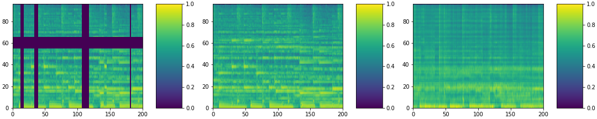
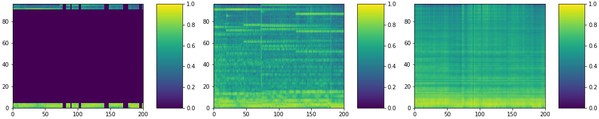

# musicoder-implementation
Implementation of https://arxiv.org/abs/2008.00781

## Overview

The majority of the code is adapted from the [Google BERT repo](https://github.com/google-research/bert).

To install the requirements:
```
pip install -r requirements.txt
```

## Pipeline
- Run create_pretraining_data.py to create .tfrecord file(s) with your processed pretraining data
```
python create_pretraining_data.py --num_features 96 --max_seq_length 200 --output_file ../data/runC_train.tfrecord --input_file ../data/normalized_mtg_00_train.npy

python create_pretraining_data.py --num_features 96 --max_seq_length 200 --output_file ../data/runC_val.tfrecord --input_file ../data/normalized_mtg_00_val.npy
```
- Run run_pretraining.py to pre-train the model
```
python run_pretraining.py --bert_config_file ./small_config.json --num_features 96 --max_seq_length 200 --input_file ../data/runC_train.tfrecord --output_dir ./outputs --do_train --num_train_steps 100000
```
- Evaluate pretraining metrics with run_pretraining.py
```
python run_pretraining.py --bert_config_file ./small_config.json --num_features 96 --max_seq_length 200 --input_file ../data/runC_val.tfrecord --output_dir ./outputs --do_eval --predict_batch_size 10
```
- *TODO*: once we have the pretrained model, fine-tune and run on downstream tasks

## create_pretraining_data.py
- reads input files (currently these should be .npy files)
- create_training_instances (function)
	- Reads .npy files, applies masking (defined in ccm and cfm functions), and saves as .tfrecord files
- outputs to output file(s)


## run_pretraining.py
- Reads input training example files (.tfrecord files)
- Build model_fn with model_fn_builder
	- Gathers input_frames, input_mask, original_frames, pretrain_mask from features dict
	- Creates model instance
	- Calculate total and per-example loss for the model in get_pretrain_output fn
	- Update losses if in training mode; return metrics if in eval mode
- Build estimator using model_fn and run configuration
- If --do-train flag enabled, run pre-training
	- Build train_input_fn with input_fn_builder
		- The input_fn maps, batches, and shuffles the input examples from the tfrecord files.
	- Run training
- If --do_eval flag enabled, run evaluation and output results to file (as well as print)

## Proof-of-concept pretraining images

The below images are taken from a proof-of-concept run of the pretraining task. A much smaller version of the model was used
(hidden size 128, 2 attention heads, 2 hidden layers), trained on ~180 clips of mel-spectrograms from MTG Jamendo tracks.
Training was run for 100,000 steps (took approx. 100 mins on a single GTX 1070 GPU) and validation performed on 20 clips.
The first graph is the input (masked) spectrogram, the second the original (unmasked), and the third the model's reconstruction.
The x axis shows the frame (i.e., time) and the y axis shows the mel-spectrogram channels (there are 96 bins).

#### Easy example (not much masking):



#### Hard example (lots of masking):



For more examples, see folder images/pretrain_poc

## Changelog

- 2/2:
	- Added original_frames and pretrain_mask features to create_training_instances.py
	- Transform input into hidden_size dimensions, then add sinusoidal positional embeddings to input in DummyModel
	- Still TODO: add post-encoder feed-forward layers to generate reconstructed frames; calculate Huber Loss between reconstructed frames and original
- 2/9:
	- Added post-encoder feed-forward layers to generate reconstructed frames
	- Added Huber Loss calculation between reconstructed frames and original and set that as pre-training objective to minimize
		- Currently, it calculates reconstruction loss between ALL values (not just the ones originally masked in the beginning.)
	- Incorporated transformer model into DummyModel (and renamed it MusicoderModel since it's no longer Dummy)
- 2/18:
	- Added --predict_batch_size N flag to run_pretraining.py to output N dicts corresponding to prediction examples for visualization (in do_eval mode only)
	- Added "visualize_pretraining_examples.ipynb" notebook to utility_scripts, which visualizes the examples produced by --predict_batch_size
	- Created [Google Doc](https://docs.google.com/document/d/1qqnfDKcJP2NdCCC7bj7b43cZp4koVYMGNWGiGZSsVlE/edit) to estimate what resources / tasks are necessary to get the implementation running on a TPU on MICA's GCP account
- 2/25:
	- Added pretraining proof-of-concept images to documentation / repo
	- Change logging verbosity to INFO and add logging hook to print training loss every 1000 steps